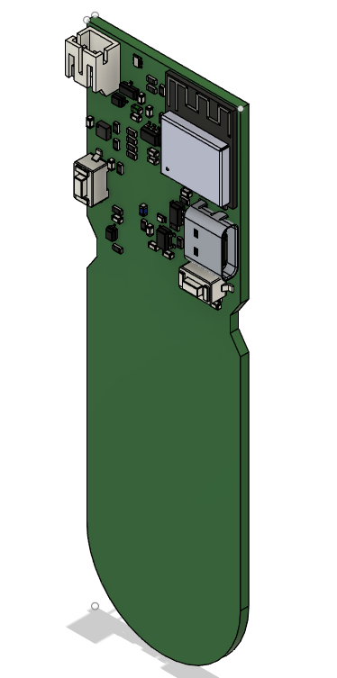
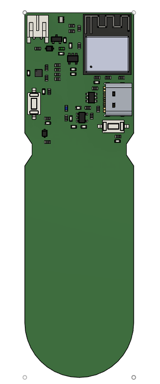

# Mosty-S

    </a>

Mosty-S is an open source embedded device meticulously designed to cater to the needs of agricultural enthusiasts and environmentalists alike. This versatile device discreetly measures **soil moisture levels**, **ambient light**, and **temperature**, offering valuable insights into the surrounding environment. Powered by the reliable [ESP32-C3](https://www.espressif.com/sites/default/files/documentation/esp32-c3_datasheet_en.pdf) single core RISC-V 160MHz CPU with WiFi and Bluetooth capabilities, Mosty-S ensures seamless data transmission for real-time monitoring through WiFi. The user can download [ESP Rainmaker](https://rainmaker.espressif.com/) mobile application, power the board and complete the provisionning by entering WiFi credentials. The application shows in real-time all the information gathered by Mosty-S. With a focus on simplicity and efficiency, Mosty-S enables users to make informed decisions, optimize irrigation practices, and foster sustainable plant growth. Embracing the spirit of open source collaboration, Mosty-S invites users to be a part of a growing community committed to enhancing agricultural practices and promoting environmental consciousness. Explore the possibilities of Mosty-S and share your thoughts and improvements.

## Update 26.07.2023: Mosty-S first version is released!

It is with great pleasure that I announce the first release of Mosty-S. While the project is still in progress and has a lot of room for improvement, it is now capable of offering simple features such as: 
- Reporting ADC value from soil moisture
- Reporting LUX value from light sensor 
- Reporting ambiant temperature
- Provisionning with SoftAP functionnality of ESP Rainmaker
- Battery protection
- Dual power option (USB or battery power)
  
What is still missing:
- Soil moisture data conversion
- Soil moisture calibration
- Battery ADC input reading and protection
- Ambiant light data conversion
- Push-button to reset WiFi settings credentials after provisionning with ESP Rainmaker application
- RGB LED logic and code
- Configure OTA

## GPIOs

Function | GPIO | Mode
-------- | -------- | -------- 
LED Red | GPIO5 | Output
LED Green | GPIO1 | Output 
LED Blue | GPIO7 | Output
BAT_ADC | GPIO18 | Input
PWM | GPIO6  | Output 
LTR INT | GPIO10 | Input 
I2C_SDA | GPIO20 | ** 
I2C_SCL | GPIO21 | **

## Board overview

</a>
</a>

## Flashing firmware to Mosty-S
- Configure the PlatformIO project
- Hold BOOT button, reset the board by pressing RESET button and release BOOT button. Using PlatformIO, build and upload the project to Mosty-S.